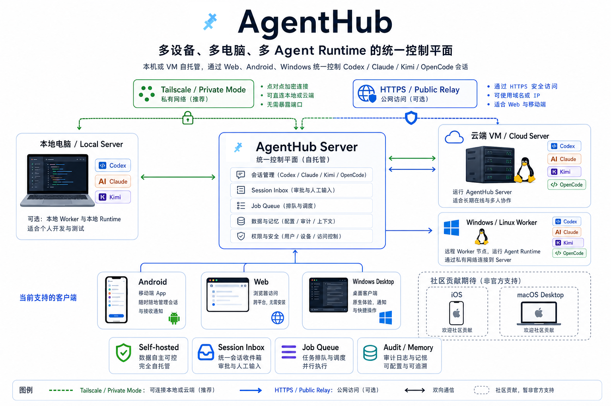

# AgentHub

[简体中文](README.md) | [English](README.en.md)

## Personal Agent Control Plane



[](.github/workflows/ci.yml)
[](docs/OPEN_SOURCE_LAUNCH.md)
[](LICENSE)
[](docs/SELF_HOST_QUICKSTART.md)
[](docs/TAILSCALE_PRIVATE_MODE.md)

AgentHub unifies Codex, Claude, Kimi, OpenCode, and other local agent runtimes across your own machines.

Run the server on a laptop or a VM. Connect through Tailscale private mode or an HTTPS public relay. Control many computers, many terminal sessions, and many agent backends from Web, Android, or Windows desktop.

AgentHub is not a hosted SaaS and not a generic remote shell. Your agents keep running on your machines, with your files, your tools, and your runtime environment. AgentHub is the session inbox, control surface, worker relay, and audit trail around them.

Architecture and deployment topology: [Architecture diagrams](docs/ARCHITECTURE.md)

## What It Does

- **One inbox for every agent session.** See local Codex, Claude, Kimi, and OpenCode sessions in one place.
- **Multi-machine control.** Register Windows and Linux workers, then route session input and health jobs to the right machine.
- **Phone and desktop access.** Use Web, Android APK, or Windows desktop to continue work away from the terminal. The Android APK asks for your server URL on first launch before showing login.
- **Tailscale-first private mode.** Start without opening worker ports to the public internet.
- **HTTPS public relay.** If you have a domain and reverse proxy, expose the Web/App entry through HTTPS while workers still use private networking or outbound-only connections.
- **Configuration-first setup.** Voice ASR, server URL, worker roots, and provider credentials are configuration, not hardcoded maintainer defaults.

## Common Scenarios

- **One main machine.** Run AgentHub server directly on Windows, macOS, or Linux. Point your phone and desktop client at the Tailscale URL. The worker can run on the same machine.
- **Cloud VM plus local workers.** Put the server on a small VM with HTTPS. Connect Windows/Linux workers through Tailscale private mode or public relay for always-on access and multi-machine coordination.
- **Phone-based check-ins.** Install the Android APK, enter your own server URL on first launch, then use the same account to inspect sessions, reply, approve prompts, and check worker state.
- **No exposed workers.** Expose only the Web/API entry through HTTPS. Keep worker ports, SSH, and databases private.
- **Agent-assisted deployment.** Fill in the [Deployment brief template](docs/DEPLOYMENT_BRIEF.example.json), then let Codex / Claude Code follow the [AI deployment runbook](docs/AI_DEPLOYMENT_RUNBOOK.md).

Tips:

- For local-server setups, prefer a Tailscale DNS name or `100.x.y.z` address in Android so LAN IP changes do not break the app.
- For public VM setups, use HTTPS for Web/App login; do not use plain public `http://` for authenticated access.
- A worker can live on the same machine as the server or on many separate machines. AgentHub routes jobs and syncs state; agent runtimes still use the worker's local environment.
- iOS client and macOS desktop are not first-party surfaces yet. Contribution prompts and guardrails are already in `CONTRIBUTING.md`.

## Getting Started

Choose one server install mode first, then copy the matching command:

| Mode | Best for | Default entry | First command |
| --- | --- | --- | --- |
| **Local mode** | One main machine, fast private setup | `http://localhost:43073` | `npm run local:dev` |
| **Docker mode** | Existing Docker host, less host-native setup | `http://localhost:8080` | `docker compose -f deploy/docker-compose.selfhost.yml up -d --build` |
| **VM mode** | Always-on HTTPS entry | `https://agenthub.example.com` | `curl -fsSL https://myagenthub.dev/install.sh | bash` |

Full guides:

- [Local server mode](docs/LOCAL_SERVER_MODE.md)
- [Docker self-host mode](docs/DOCKER_SELFHOST_MODE.md)
- [Self-host quickstart](docs/SELF_HOST_QUICKSTART.md)

Website install chooser:

- `https://myagenthub.dev/install/`
- `https://myagenthub.dev/download/`
- `https://myagenthub.dev/release/`

### Install workers directly with npm / npx

If your server is already running and you only need to attach a Windows or Linux machine as a worker, start here:

```bash
npx agenthub-worker doctor
npx agenthub-worker install --api-url https://agenthub.example.com --enrollment-token ahe_worker_enroll_xxx --platform linux --worker-id build-vm-01 --workspace-root /srv/work
```

The same `npx agenthub-worker install` entrypoint works on Windows with `--platform windows` and Windows-style workspace roots.

### Recommended: deploy from an agent-friendly prompt

If you want the fastest path, start with these two files and let another agent or operator drive the setup:

- [AI deployment runbook](docs/AI_DEPLOYMENT_RUNBOOK.md)
- [Deployment brief template](docs/DEPLOYMENT_BRIEF.example.json)

This path is the default recommendation for:

- delegating setup to Codex, Claude Code, or another engineering agent
- avoiding manual command assembly and configuration lookup
- switching quickly between local, Tailscale, and VM deployment modes

After deployment:

- the Android APK asks for your AgentHub server URL on first launch
- it then opens the login page for that server
- this is not passwordless access; it is server selection first, normal login second

### Local mode: one command for the local control plane

Use this when you already have Tailscale and want phone access to local agents without standing up a public VM. The default local ports are:

- Web/UI: `http://localhost:43073`
- API/healthz: `http://127.0.0.1:43080`

```powershell
copy .env.example .env
python -m venv .venv
.\.venv\Scripts\python -m pip install -r apps/api/requirements.txt
npm install
npm run local:dev
```

Open `http://localhost:43073`, create the first owner with `AGENTHUB_BOOTSTRAP_TOKEN`, then point Android or Windows desktop at your local or Tailscale URL.

Guide: [Local server mode](docs/LOCAL_SERVER_MODE.md)

### Docker mode: start a complete control plane with compose

Use this when you want the simplest containerized path and do not want to install Python, Node.js, nginx, or systemd directly on the host.

```bash
cp .env.example .env
docker compose -f deploy/docker-compose.selfhost.yml up -d --build
```

Default entry:

```text
http://localhost:8080
```

Guide: [Docker self-host mode](docs/DOCKER_SELFHOST_MODE.md)

### Public VM: self-host with HTTPS

Use this when you want always-on access, worker downloads, and optional public relay.

Fastest entry:

```bash
curl -fsSL https://myagenthub.dev/install.sh | bash -s -- \
  --domain agenthub.example.com \
  --install-root /opt/agenthub \
  --admin-email you@example.com
```

Repo-local entry:

```bash
sudo bash scripts/install-selfhost-linux.sh \
  --domain agenthub.example.com \
  --install-root /opt/agenthub \
  --admin-email you@example.com
```

Guide: [Self-host quickstart](docs/SELF_HOST_QUICKSTART.md)

If you want a fuller chooser page before picking one of the three paths, use:

- `https://myagenthub.dev/install/`
- `https://myagenthub.dev/download/`
- `https://myagenthub.dev/release/`

## Supported Surface

| Surface | Status | Notes |
| --- | --- | --- |
| Web self-host | Supported | Main console and API surface |
| Android APK | Supported | First-launch server setup, then normal login |
| Windows desktop | Supported | Electron client with first-launch server setup |
| Windows worker | Supported | Bundle + PowerShell installer |
| Linux worker | Supported | Bundle + shell/systemd installer |
| iOS client | Community welcome | Prompt and guardrails are in `CONTRIBUTING.md` |
| macOS desktop | Community welcome | Prompt and guardrails are in `CONTRIBUTING.md` |

## Docs

- [中文 README](README.md)
- [Architecture diagrams](docs/ARCHITECTURE.md)
- [Local server mode](docs/LOCAL_SERVER_MODE.md)
- [Docker self-host mode](docs/DOCKER_SELFHOST_MODE.md)
- [Self-host quickstart](docs/SELF_HOST_QUICKSTART.md)
- [Tailscale private mode](docs/TAILSCALE_PRIVATE_MODE.md)
- [Configuration reference](docs/CONFIGURATION_REFERENCE.md)
- [Branding and logo source](docs/BRANDING.md)
- [Worker package release](docs/WORKER_PACKAGE_RELEASE.md)
- [Deployment](docs/DEPLOYMENT.md)
- [Security model](docs/SECURITY.md)
- [Testing](docs/TESTING.md)
- [OSS release flow](docs/OSS_RELEASE.md)
- [Open-source launch checklist](docs/OPEN_SOURCE_LAUNCH.md)
- [Contributing](CONTRIBUTING.md)

## Build

```powershell
npm run web:build
npm run desktop:build
npm run desktop:package:win
npm run mobile:build:debug
npm run mobile:build:release
```

Generate downloadable worker bundles:

```powershell
.\.venv\Scripts\python.exe scripts\build-worker-bundle.py --output-root .runtime\worker-bundles
```

## Verification

```powershell
npm run api:test
npm run web:test
npm run web:build
npm run desktop:test
npm run mobile:test
.\.venv\Scripts\python.exe scripts\audit-public-export.py
```

The public repo should never contain private production domains, deployment credentials, local databases, runtime logs, signing keys, or generated release artifacts.
