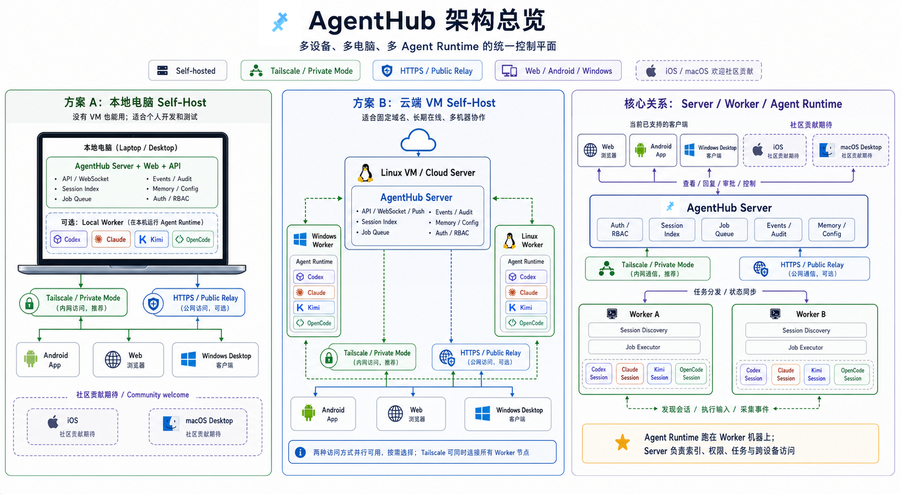

# AgentHub 架构图

## 总览

这张图把 AgentHub 的三层关系放在一起：

- **方案 A：本地笔记本 Self-Host**
  - 适合没有 VM、已经在用 Tailscale 的个人环境
  - 本机既可以跑 `AgentHub Server`，也可以同时跑 `Local Worker`
  - 手机、Web、Windows 桌面端通过本机地址、Tailscale 地址或可选 HTTPS 入口接入
- **方案 B：云端 VM Self-Host**
  - 适合固定域名、长期在线、多台机器协作
  - Linux VM 可以通过 HTTPS public relay 对外提供 Web/App 入口，也可以只放在 Tailscale private mode 里
  - Windows / Linux / macOS worker 继续跑在各自机器上，通过 Tailscale private mode 或 public relay 接入
- **社区贡献期待**
  - iOS client 和 macOS desktop 当前不是 first-party 支持面
  - `CONTRIBUTING.md` 里已有平台贡献提示词和配置化约束
- **核心关系：Server / Worker / Agent Runtime**
  - `AgentHub Server` 负责认证、权限、会话索引、任务队列、事件审计、配置和 memory
  - `Worker` 负责发现本机 session、执行任务、回传状态
  - `Codex / Claude / Kimi / OpenCode` 这些 runtime 继续运行在 worker 机器上，而不是运行在控制平面里

## 怎么理解这几个角色

### AgentHub Server

控制平面。它不直接替你运行 agent，而是统一负责：

- 登录和权限控制
- session inbox 和时间线
- job queue 和 worker 调度
- 审批、事件、审计记录
- 配置和跨设备访问入口

### Worker

执行平面。它部署在真正跑 agent 的机器上，负责：

- 发现本机已有 session
- 把 Web / App 发来的输入转成对应 runtime 的操作
- 采集状态和事件，再同步回 server

### Agent Runtime

真正做事的还是你机器上的 runtime，例如：

- Codex
- Claude
- Kimi
- OpenCode

所以 AgentHub 的设计重点不是“托管你的 agent”，而是“统一控制和同步这些已经在你机器上运行的 agent”。

## 两种推荐拓扑

### 1. 本机 Self-Host

适合：

- 只有一台主要工作电脑
- 不想买 VM
- 想直接通过 Tailscale 从手机控制本机 agent
- 或者想先在本机验证，再决定是否迁移到 VM

配套文档：

- [Local server mode](LOCAL_SERVER_MODE.md)
- [Tailscale private mode](TAILSCALE_PRIVATE_MODE.md)

### 2. VM Self-Host

适合：

- 需要稳定公网域名
- 想把 Web / App 入口长期在线暴露出来
- 有多台 worker 机器需要接入
- 或者想把云端 VM 放进 Tailscale，只给自己和团队访问

配套文档：

- [Self-host quickstart](SELF_HOST_QUICKSTART.md)
- [Deployment](DEPLOYMENT.md)
- [Security model](SECURITY.md)
